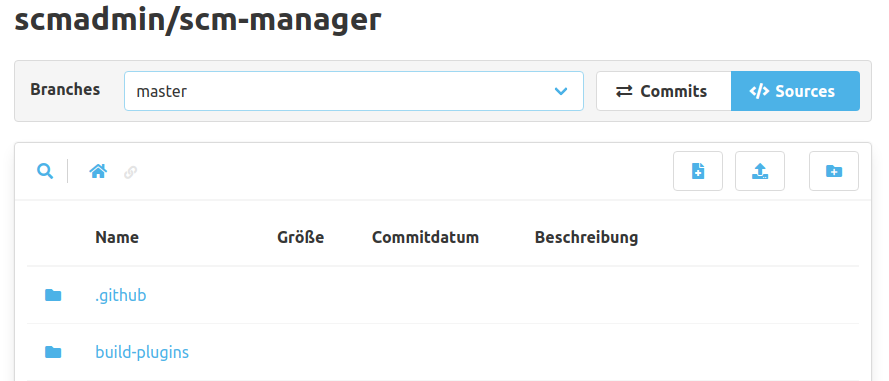
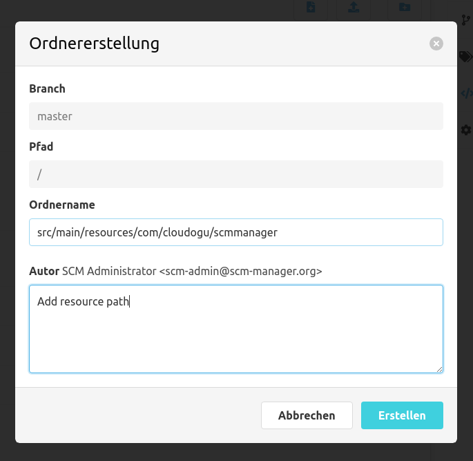

In der Code Ansicht können neue Verzeichnisse mit dem Knopf "Ordner erstellen" in der oberen Leiste erstellt werden.

Hierfür öffnet sich ein Dialog, in dem der neue Ordner sowie eine Commit-Nachricht eingetragen werden müssen. Als
Ordner können auch mehrere verschachtelte Ordner auf einmal erstellt werden.

Im erstellten Ordner wird eine Datei `.scmkeep` abgelegt, da z. B. in Git oder in Mercurial keine leeren Ordner
erzeugt werden können. Diese Datei kann entfernt werden, wenn andere Dateien in dem Ordner hinzugefügt wurden.
