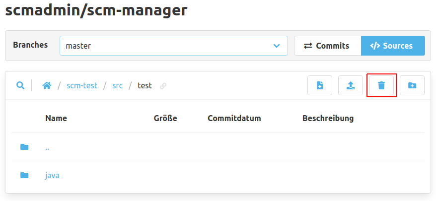
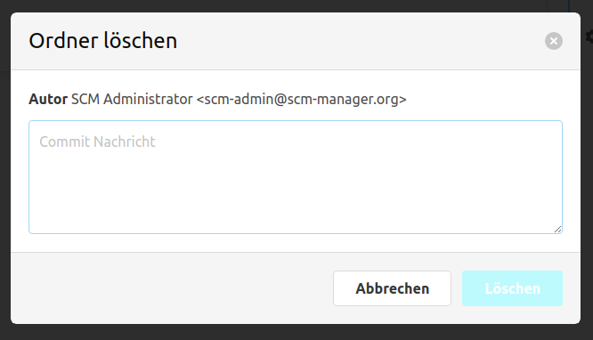

In der Code Ansicht können bestehende Verzeichnisse mit dem Knopf "Ordner löschen" in der oberen Leiste rekursiv
gelöscht werden. Dabei werden auch alle Dateien, die in diesen Verzeichnissen sind, mit gelöscht.

Hierfür öffnet sich ein Dialog, in dem eine Commit-Nachricht eingetragen werden muss.

