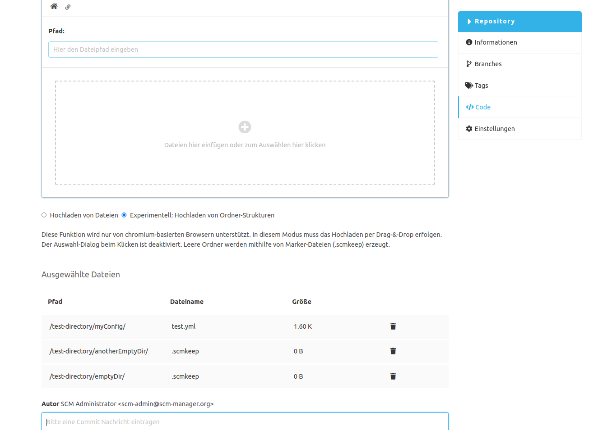

Das Hochladen von Verzeichnissen mit Dateien kann über die Standard-Implementierung im Editor Plugin realisiert werden.
Dabei werden leere Verzeichnisse vom Browser ignoriert, da gängige Browser nativ nur auf Datei-Ebene hochladen können.
Für den speziellen Anwendungsfall auch leere Verzeichnisse hochladen zu können, bietet das Manage Folder Plugin eine zweite Strategie an.

Unter der Dropzone kann der experimentelle Modus für das Hochladen von Verzeichnisstrukturen gewählt werden. 
Dieser Modus verlangt einige Einschränkungen. Der Datei Selektor Dialog ist deaktiviert. 
Stattdessen muss das Hochladen über Drag-&-Drop erfolgen.
Diese Strategie funktioniert nur auf Browsern, die auf Chromium basieren wie z.B. Chrome oder Microsoft Edge.
Leere Ordner werden nach dem Hochladen nicht wirklich leer erzeugt, sondern bekommen eine Marker-Datei (.scmkeep), 
da einige Versionskontrollsysteme wie z.B. Git das Konzept "Verzeichnisse" nicht kennen und nur Dateien versioniert werden. 

