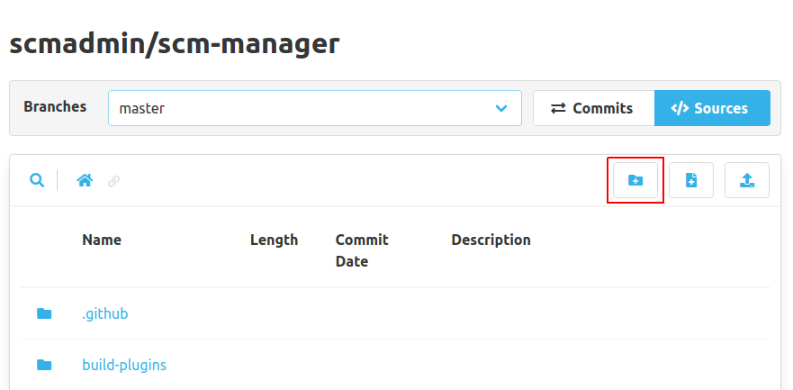
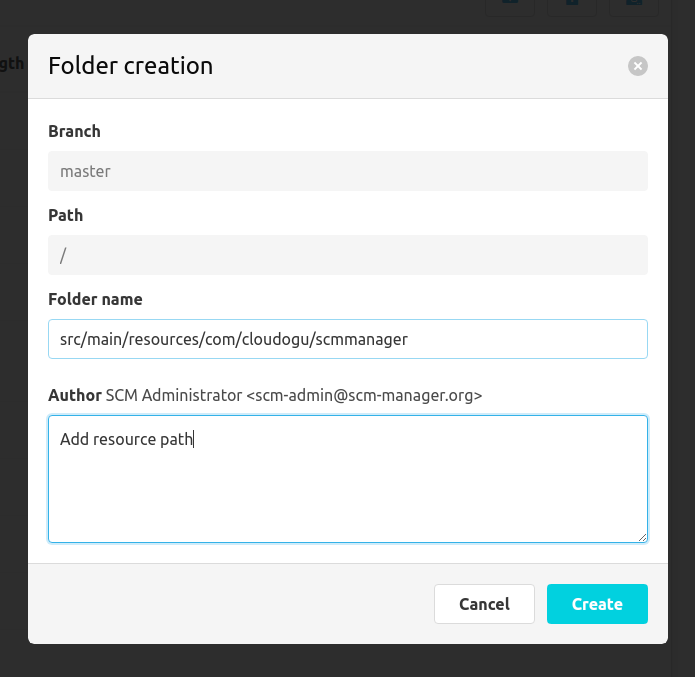

In the code view, folders can be created with the "Create folder" button.

To do so, a dialog will open where the new folder and a commit message have to be entered. It is possible, to create
multiple nested folders in one step.

In the new folder, a file named `.scmkeep` is created, because you cannot craete empty folders for example in Git
or Mercurial. This file can be removed, as soon as there are other files in this folder.
