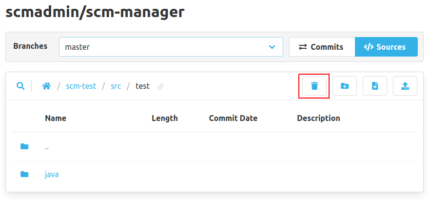
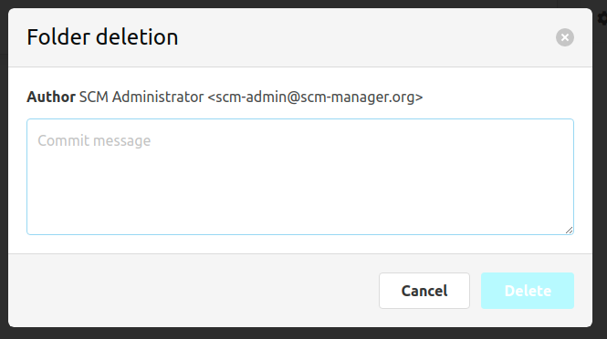

In the code view, folders can be deleted recursively with the "Delete folder" button.
This will also delete all files in this folder.

To do so, a dialog will open where a commit message has to be provided.

