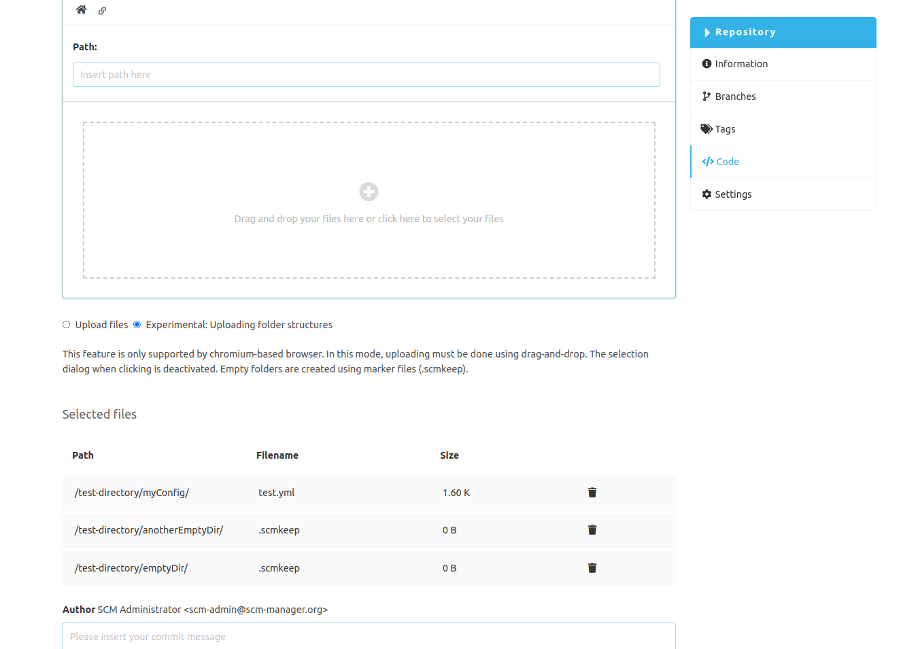

Folders with files can be uploaded using the standard implementation in the Editor plugin.
Empty folders are ignored by the browser, as common browsers can only upload at file level natively.
The Manage Folder plugin offers a second strategy for the special use case of also being able to upload empty directories.

The experimental mode for uploading directory structures can be selected under the drop zone.
This mode requires some restrictions. The file selector dialog is deactivated.
Instead, uploading must be done via drag-&-drop.
This strategy only works on browsers based on Chromium, such as Chrome or Microsoft Edge.
Empty folders are not really created empty after uploading, but are given a marker file (.scmkeep),
as some version control systems such as Git do not recognize the concept of "directories" and only files are versioned.

